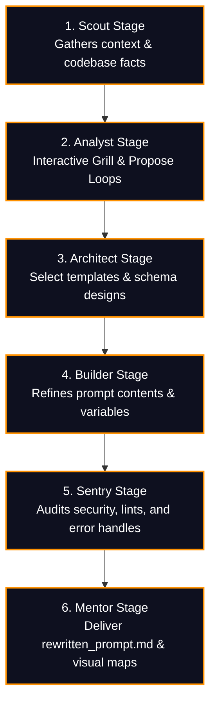

> [!IMPORTANT]
> **DISCLAIMER & LIABILITY NOTICE**: This is a **personal, individual project** created and maintained entirely by the author (Prashanth). It is **not** an official Google product, it is **not** affiliated with or supported by Google Cloud or Google LLC, and it does **not** come with any official support or warranty. By using this software, you acknowledge that you are solely liable for its use.

# ✍️ Prompt Writer

[](https://skills.sh)


An advanced, meta-level custom skill designed for Google Antigravity that programmatically transforms basic, vague, or incomplete user requests into highly-structured, technically precise, and optimized instruction sets designed specifically for LLMs.

The **Prompt Writer** guides you through an interactive "Grill & Propose" design alignment interview, maps framework dependencies, structures robust error boundaries, and compiles instant-execution templates.

---

## 🔄 The Interactive Grill & Rewrite Pipeline

The custom skill coordinates technical refinement and asset planning through a highly structured 6-stage lifecycle:



---

## 📁 Repository Structure

The package is fully modular and compatible with `npx skills` installation guidelines:

| Path | Type | Purpose |
| :--- | :--- | :--- |
| `skills/prompt-writer/SKILL.md` | Core Instructions | Standard system instructions, socratic question-banks, and compiler variables. |
| `skills/prompt-writer/references/template.md` | Codebase Template | The authoritative XML prompt envelope schema for Google Gemini models. |
| `skills/prompt-writer/examples/example.md` | Examples | Complete before-and-after showcase comparing original vague inputs and completed outputs. |
| `scripts/validate_skill.sh` | Shell Script | Automated structural audit testing frontmatter, files, and link integrity. |

---

## 🛠️ Installation & Setup Guide

To utilize the **Prompt Writer** custom skill, you must set up both your **Custom Companion Skills** (written by you) and ensure your **Native 3P Agent Skills & MCP Servers** (bundled with Antigravity) are active.

---

### 1️⃣ Install Custom Companion Skills (1P)

The prompt-writing pipeline integrates directly with your other custom skills. Install them using `npx skills`:

```bash
# Install the 6 AI Personas pipeline coordinator
npx skills add ksprashu/skills-6-personas

# Install the OKF Knowledge Catalog schema framework
npx skills add ksprashu/skills-knowledge-catalog

# Install the Prompt Writer itself
npx skills add ksprashu/skills-prompt-writer
```

---

### 2️⃣ Verify Pre-Installed Platform Agent Skills (3P)

The Prompt Writer leverages these advanced, natively bundled platform skills. They are pre-installed in the Antigravity system and do not require manual setup, but can be verified under your skills directory:

| Native 3P Skill | Purpose inside Prompt-Writer | Local Location / Access Path |
| :--- | :--- | :--- |
| **[google-antigravity-sdk](file:///Users/ksprashanth/.gemini/config/plugins/google-antigravity-sdk/skills/google-antigravity-sdk/SKILL.md)** | Drives python SDK orchestration and Multi-Agent tier parallelization (`execute_pipeline.py`). | `~/.gemini/config/plugins/google-antigravity-sdk/` |
| **[mandatory-secure-web-skills](file:///Users/ksprashanth/.gemini/config/plugins/Google.securecoder.securecoder/skills/securecoder_generation/SKILL.md)** | Runs dependency validation (`scan_dependencies`) and threat audits (`run-security-scanner`). | `~/.gemini/config/plugins/Google.securecoder.securecoder/` |
| **[chrome-devtools](file:///Users/ksprashanth/.gemini/config/plugins/chrome-devtools-plugin/skills/chrome-devtools/SKILL.md)** | Powers visual layout testing and browser DOM automation through `browser_subagent`. | `~/.gemini/config/plugins/chrome-devtools-plugin/` |
| **[a11y-debugging](file:///Users/ksprashanth/.gemini/config/plugins/chrome-devtools-plugin/skills/a11y-debugging/SKILL.md)** | Audits accessibility, tap targets, color contrasts, and keyboard navigations. | `~/.gemini/config/plugins/chrome-devtools-plugin/` |
| **[modern-web-guidance](file:///Users/ksprashanth/.gemini/config/plugins/modern-web-guidance-plugin/skills/modern-web-guidance/SKILL.md)** | Enforces advanced layout queries, HSL colors, responsive design, and CSS transitions. | `~/.gemini/config/plugins/modern-web-guidance-plugin/` |
| **[antigravity-guide](file:///Users/ksprashanth/.gemini/antigravity-cli/builtin/skills/antigravity_guide/SKILL.md)** | Maps all built-in agy commands, slash triggers, and IDE configurations. | `~/.gemini/antigravity-cli/builtin/skills/` |

---

### 3️⃣ Enable Supporting Model Context Protocol (MCP) Servers

The Scout and Analyst stages query several MCP servers to parse live specifications, compile UI screens, or analyze databases. Ensure the following servers are registered inside your `~/.gemini/antigravity-cli/mcp/` directory:

*   **`google-developer-knowledge`**: Local RAG semantic search engine used by the `Docs Crawler` subagent to extract authorized Google Cloud APIs and library specifications.
*   **`context7`**: Documentation resolving server used by `Docs Crawler` to fetch specific package versions and signatures.
*   **`chrome-devtools-mcp`**: Active Chromium automation engine driving the `browser_subagent` visual screenshot capture.
*   **`StitchMCP`**: Visual screens compiler and Design System engine for UI layout prototyping.
*   **`bigquery`**: Cloud SQL executing framework for data-intensive or machine-learning pipelines.

> [!TIP]
> Use the standard list command inside your terminal to verify that all MCP tools are active:
> ```bash
> agy mcp list
> ```

---

## 🚀 Quickstart Example

To rewrite and optimize a basic request, invoke the custom skill in your Antigravity chat:

> *"Rewrite my prompt about creating a secure PostgreSQL integration using our prompt-writer skill."*

1.  **🎓 Scout Stage**: The agent maps the workspace, spins up three background subagents (`Codebase Scout`, `Web Intelligence Analyst`, and `Docs Crawler`) to scrape databases, configurations, and API references.
2.  **🕵️ Analyst Stage**: Initiates a focused Socratic "Grill & Propose" loop to clarify choices (e.g., choice of pooling library, schema standards) and logs them into `.gemini/knowledge/analyst/user_decisions.md`.
3.  **📐 Architect Stage**: Selects the XML envelope, configures model resource tiering (mapping parallel sub-tasks to dynamic **Gemini 3.5 Flash** tiers), and designs shared Pydantic data contracts.
4.  **🛠️ Builder Stage**: Assembles the refined prompt with clear XML context tags and saves it as an executable `rewritten_prompt.md` artifact.
5.  **🛡️ Sentry Stage**: Sets up automated dependency scanning (`scan_dependencies`) and visual testing workflows.
6.  **🏫 Mentor Stage**: Displays the finalized prompt, presents a complete visual Mermaid architecture of the execution pipeline, and awaits your approval. Click **"Proceed"** to execute!

