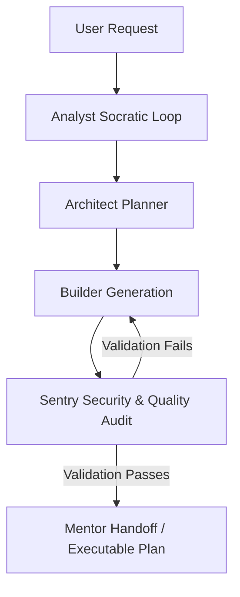

# Google Antigravity Prompt-Writer User Guide: Prerequisites & Dependency Setup

This comprehensive user guide provides instructions for configuring and installing all required skills, background subagents, and Model Context Protocol (MCP) servers integrated with the **Prompt-Writer** custom skill. 

To achieve the full parallelization, automated context engineering, security auditing, and verification capabilities described in the `references/template.md`, you must ensure all the dependencies outlined below are fully installed and configured in your Google Antigravity environment.

---

## 🗺️ Navigation Architecture

### Theoretical & Architecture Chapters
1. [Overview & Cognitive Architecture](#-1-overview--cognitive-architecture)
2. [Automated Context Engineering (Scout Stage)](#-2-automated-context-engineering-scout-stage)
3. [Dependency-First Security Lifecycle (Sentry Stage)](#-3-dependency-first-security-lifecycle-sentry-stage)

### Practical Setup & Project Artifacts
4. [Prerequisite Skills Installation Matrix](#-4-prerequisite-skills-installation-matrix)
5. [Model Context Protocol (MCP) Configuration](#-5-model-context-protocol-mcp-configuration)
6. [Step-by-Step Installation & Verification Runbook](#-6-step-by-step-installation--verification-runbook)

---

## 🧠 1. Overview & Cognitive Architecture

The `prompt-writer` skill is designed as a **6-Persona Pipeline** that coordinates complex task preparation, context engineering, and quality-sentry loops before execution. It acts as a cognitive conductor, delegating intensive tasks to background subagents and leveraging specialized security and documentation subsystems.



Without installing the required companion skills and configuring the corresponding MCP servers, several stages of the pipeline will fall back to degraded execution modes or trigger runtime errors.

---

## 📡 2. Automated Context Engineering (Scout Stage)

During the **Scout Stage**, the executing agent spawns three specialized background subagents to map the workspace and retrieve technical documentation concurrently. These subagents require specific system-level integrations:

*   **Codebase Scout**: Relies on file-searching utilities and standard workspace filesystem operations.
*   **Web Intelligence Analyst**: Requires permission to perform external web searches to pull live version telemetry and best-practice release summaries.
*   **Docs Crawler**: Queries authoritative technical specifications from your configured Model Context Protocol (MCP) servers.

---

## 🛡️ 3. Dependency-First Security Lifecycle (Sentry Stage)

The **Sentry Stage** enforces a rigid, non-linear validation loop. It strictly mandates checking third-party packages and scanning code for structural flaws before any execution handover:

1.  **Scan Dependencies**: Invoked before importing any package to prevent supply-chain vulnerabilities.
2.  **Run Security Scanner**: Audits newly created source code for XSS, SQL injection, hardcoded secrets, and high-risk CWEs.
3.  **Visual and Multi-Modal Audit**: Automates browser navigation and page-rendering verification to check layout symmetry, table alignment, and responsiveness.

---

## 📦 4. Prerequisite Skills Installation Matrix

To utilize the full capabilities of the prompt-writer pipeline, ensure that the following custom and built-in skills are fully installed and registered within your global customizations root directory (`~/.gemini/config/skills/`):

<style>
th:first-child, td:first-child {
    white-space: nowrap;
}
td:first-child code {
    white-space: nowrap !important;
    word-break: normal !important;
}
</style>

| Required Skill / Plugin | Purpose & Integration in Pipeline | Source Location / Command & Local Deep Link |
| :--- | :--- | :--- |
| **`6-personas`** | Defines the core 6-persona pipeline stages (Scout, Analyst, Architect, Builder, Sentry, Mentor) mapping the cognitive execution flow. | Repo: [skills-6-personas/SKILL.md](file:///Users/ksprashanth/code/github/skills-6-personas/skills/6-personas/SKILL.md)<br>Global: [6-personas/SKILL.md](file:///Users/ksprashanth/.gemini/skills/6-personas/SKILL.md) |
| **`knowledge-catalog`** | Governs the creation, schema validation, and indexing of the OKF Knowledge Bundle. | Repo: [skills-knowledge-catalog/SKILL.md](file:///Users/ksprashanth/code/github/skills-knowledge-catalog/skills/knowledge-catalog/SKILL.md)<br>Global: [knowledge-catalog/SKILL.md](file:///Users/ksprashanth/.gemini/skills/knowledge-catalog/SKILL.md) |
| **`antigravity-guide`** | Reference for Antigravity's native commands, capabilities, and system configurations. | System: [antigravity_guide/SKILL.md](file:///Users/ksprashanth/.gemini/antigravity-cli/builtin/skills/antigravity_guide/SKILL.md) |
| **`google-antigravity-sdk`** | Orchestrates python SDK and multi-agent resource tier allocations concurrently. | Native: [google-antigravity-sdk/SKILL.md](file:///Users/ksprashanth/.gemini/config/plugins/google-antigravity-sdk/skills/google-antigravity-sdk/SKILL.md) |
| **`mandatory-secure-web-skills`** | Governs session security, input sanitation, and database access controls. | Native: [securecoder_generation/SKILL.md](file:///Users/ksprashanth/.gemini/config/plugins/Google.securecoder.securecoder/skills/securecoder_generation/SKILL.md) |
| **`scan_dependencies`** | Performs supply-chain security checks on third-party libraries before imports are allowed. | Native: [scan_dependencies/SKILL.md](file:///Users/ksprashanth/.gemini/config/plugins/Google.securecoder.securecoder/skills/scan_dependencies/SKILL.md) |
| **`run-security-scanner`**| Executes static application security testing (SAST) to detect common vulnerabilities. | Native: [run-security-scanner/SKILL.md](file:///Users/ksprashanth/.gemini/config/plugins/Google.securecoder.securecoder/skills/run-security-scanner/SKILL.md) |
| **`create-security-implementation-plan`** | Authoring a secure coder checklist for the implementation phase. | Native: [create_security_implementation_plan/SKILL.md](file:///Users/ksprashanth/.gemini/config/plugins/Google.securecoder.securecoder/skills/create_security_implementation_plan/SKILL.md) |
| **`chrome-devtools`** | Drives browser automation subagents to visually verify themes and responsive grids. | Native: [chrome-devtools/SKILL.md](file:///Users/ksprashanth/.gemini/config/plugins/chrome-devtools-plugin/skills/chrome-devtools/SKILL.md) |
| **`a11y-debugging`** | Performs accessibility audits, contrast validation, and keyboard interaction tests. | Native: [a11y-debugging/SKILL.md](file:///Users/ksprashanth/.gemini/config/plugins/chrome-devtools-plugin/skills/a11y-debugging/SKILL.md) |
| **`modern-web-guidance`** | Coordinates fluid container queries, modern layout variables, and responsive design systems. | Native: [modern-web-guidance/SKILL.md](file:///Users/ksprashanth/.gemini/config/plugins/modern-web-guidance-plugin/skills/modern-web-guidance/SKILL.md) |


---

## 🔌 5. Model Context Protocol (MCP) Configuration

To support the **Docs Crawler** subagent in fetching live documentation, type contracts, and Pydantic interfaces, configure the following MCP servers in your workspace environment configuration file (`~/.gemini/config/mcp.json` or equivalent settings):

### A. Core Documentation Crawler Servers

#### 1. `content7`
*   **Purpose**: Resolves standard library IDs and queries detailed technical documentation for developer frameworks, languages, and frontend components.
*   **Integrated Tools**: `resolve-library-id`, `query-docs`.

#### 2. `google-developer-knowledge` (referred to as `developer-knowledge`)
*   **Purpose**: Provides cloud developer specifications, SDK definitions, API structures, and cloud platform guidelines.
*   **Integrated Tools**: `search_documents`, `answer_query`, `get_documents`.

### B. Visual Auditing Server

#### 1. `chrome-devtools-mcp`
*   **Purpose**: Orchestrates background browser instances, navigates test domains, takes UI screenshots, and registers automated console audit traces.
*   **Integrated Tools**: `new_page`, `navigate_page`, `take_screenshot`, `click`, `fill`.

---

## 🚀 6. Step-by-Step Installation & Verification Runbook

Follow these sequential steps to install the prerequisite components and verify that your workspace is fully prepared.

### Step 1: Install & Register custom skills

To register the two primary custom skills (`prompt-writer` and `knowledge-catalog`) globally within your Antigravity environment:

```bash
# 1. Clone/add the prompt-writer skill
npx skills add ksprashu/skills-prompt-writer

# 2. Clone/add the companion knowledge-catalog skill
npx skills add ksprashu/skills-knowledge-catalog
```

> [!TIP]
> If you prefer a local symbolic link setup for development, you can link them manually:
> ```bash
> ln -s "/absolute/path/to/skills-prompt-writer/skills/prompt-writer" "$HOME/.gemini/config/skills/prompt-writer"
> ln -s "/absolute/path/to/skills-knowledge-catalog/skills/knowledge-catalog" "$HOME/.gemini/config/skills/knowledge-catalog"
> ```

### Step 2: Validate Plugin Access (SecureCoder & DevTools)

Ensure that the SecureCoder and Chrome DevTools plugins are registered and visible. You can list your active permissions and tool access via:

```bash
# Verify active permission scopes and loaded plugins
agy list-permissions
```

Ensure the following tools are available in the output:
- `default_api:call_mcp_tool` (with Chrome DevTools active)
- `default_api:run-security-scanner` or security-equivalent execution capabilities.

### Step 3: Run the Verification Script

The `skills-prompt-writer` repository includes a built-in validation script to verify formatting correctness, frontmatter configuration, and file paths. Execute it from your project root:

```bash
bash scripts/validate_skill.sh
```

### Step 4: Verify MCP Integration

To verify that the Docs Crawler and Sentry browser systems can resolve live data, test tool invocation status directly:

```bash
# List available tools on content7 server
agy mcp list-resources --server content7

# Check connection status of developer-knowledge base
agy mcp list-resources --server google-developer-knowledge
```

> [!NOTE]
> If any server is missing, verify your global configurations and ensure you have authorized execution permissions when prompting.

---

## 🎯 7. Sandbox Verification Challenge

To verify that the custom skills are coordinating correctly, open an empty sandbox folder and run the following command to test the pipeline:

```bash
# Initialize a verification run
agy /prompt-writer "Create an automated pipeline script that queries BigQuery and renders a lightweight responsive dashboard"
```

Observe if the **Docs Crawler** subagent successfully contacts your MCP documentation databases and registers the correct specification data inside `scratch/context_engineering/docs_crawler.json`.

---

> [!IMPORTANT]
> **Aesthetic Compliance**: Conforms strictly to the Light-theme-first visual standards and nowrap responsive layout conventions specified for Antigravity documentation.
