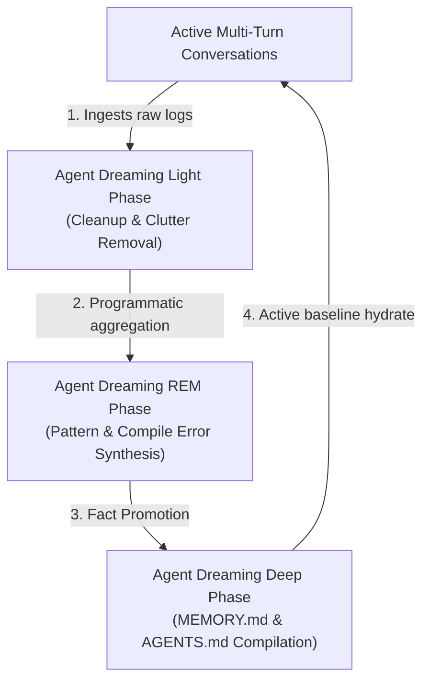
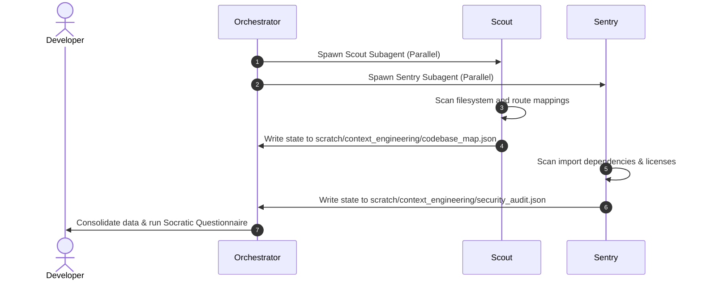

# Genesis Dream: Workspace Architecture Map

This blueprint maps the structural layout, model tiering parameters, parallelization pipelines, and cognitive state-backpropagation mechanics governing the newly initialized workspace.

---

## 💤 1. The Persistent Cognitive Lifecycle

The workspace operates as a continuous stateful environment. While active conversations execute fast, non-linear steps, the **Agent Dreaming** cycle guarantees that the workspace remains clean, organized, and structurally updated:

1.  **Light Phase (Ingestion & Pruning)**: Scans workspace folders to prune intermediate scripts, temporary backups, or build scratchcards, leaving a clean workspace.
2.  **REM Phase (Pattern Synthesis)**: Extracts compile-time, test, and command-line error patterns from the `transcript.jsonl` log file to discover repeated failure vectors and recurring manual tasks.
3.  **Deep Phase (Memory Promotion)**: Permanently writes verified facts to `.gemini/knowledge/MEMORY.md` and style conventions to `.agents/AGENTS.md` while logging the retrospective in `.gemini/knowledge/DREAMS.md`.

---

## 🛠️ 2. Multi-Agent Resource & Model Tiering

To optimize execution latency, API quotas, and resource costs, tasks are divided hierarchically across three distinct tiers of the fast **Gemini 3.5 Flash** model:

```mermaid
gantt
    title Cognitive Model Tiering Schedule
    dateFormat  X
    axisFormat %s
    section High-Reasoning (Flash High)
    Planning & Threat Modeling      :active, 0, 10
    Socratic Grilling & Audits      :active, 10, 20
    section Builder-Coding (Flash Medium)
    Module Generation & Writing      : 0, 15
    Component Compilation Checks    : 15, 20
    section Programmatic (Flash Low)
    File-Writing & Code Injection   : 0, 10
    Automated Testing Suite Runs    : 10, 20
```

-   **High Tier (`gemini-3.5-flash-high`)**: Tasked with system planning, BDD test-suite mapping, security auditing, and socratic interviews where architectural reasoning is key.
-   **Medium Tier (`gemini-3.5-flash-medium`)**: Tasked with writing source code, editing classes, parsing JSON schemas, and verifying compiler integrity.
-   **Low Tier (`gemini-3.5-flash-low`)**: Tasked with rapid single-file updates, executing CLI tools, running lint suites, and programmatically writing test assets.

---

## ⚡ 3. Multi-Agent Shared-State Communications

Parallel subagents avoid bloated chat logs and trace histories by communicating programmatically through the shared `/scratch/` directory:

This decoupled sequence prevents multiple subagents from writing overlapping outputs to the active chat stream, securing absolute transcript readability.
