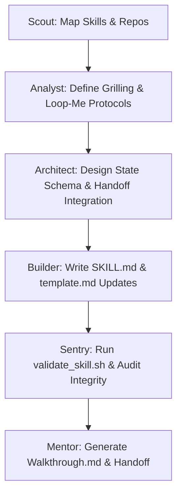

# Implementation Plan - Prompt-Writer Error Resilience & Antigravity Harness Integration

This implementation plan outlines the steps for enhancing the `prompt-writer` and `6-personas` custom skills to support continuous file-based state journaling, resilient self-resumption, Matt Pocock's grilling discipline, and strict Antigravity lifecycle integration.

---

## 🎯 High-Level Success Metric
- **Absolute resilience**: The skills can resume from `.gemini/tasks/state_journal.json` and `.gemini/tasks/task.md` upon any crash or turn reset.
- **Matt Pocock Grilling Integration**: Continuous, Socratic, one-question-at-a-time clarification loop with proactive recommended defaults.
- **Antigravity Harness Integration**: Mandatory generation of `implementation_plan.md`, `task.md`, automated verification checks, and `walkthrough.md` reports during execution handoff.

---

## 🧭 Architectural Mapping (The 6-Persona Blueprint)

---

## 🛠️ Detailed Tasks & Checklist

### Phase 1: Context Grounding & Setup [Scout]
- [x] Map workspace directories of local `skills-prompt-writer` and global `.gemini/skills/6-personas/`.
- [x] Locate and clone Matt Pocock's skills repository for design reference.

### Phase 2: Design & Cognitive Blueprinting [Analyst/Architect]
- [x] Formulate the Matt Pocock Grilling Discipline (one question at a time, recommended default answer attached to each).
- [x] Design the Antigravity Execution Harness (mandating `implementation_plan.md`, `task.md`, automated checks, and `walkthrough.md` at Phase 2 start).

### Phase 3: Implementation & Construction [Builder]
- [x] Modify `skills-prompt-writer/skills/prompt-writer/SKILL.md` to inject the Matt Pocock Grilling loop and Antigravity Execution handoff.
- [x] Modify `skills-prompt-writer/skills/prompt-writer/references/template.md` to inject the Antigravity Walkthrough & Verification milestone.
- [x] Modify `skills-6-personas/skills/6-personas/SKILL.md` to incorporate the file-based state journal and automatic hydration loops.
- [x] Rename the parent folder of `skills-6-archetypes` to `skills-6-personas` and realign the system symlinks cleanly.

### Phase 4: Sentry Audit & Verification [Sentry]
- [x] Run `./scripts/validate_skill.sh` to ensure structural validity.
- [x] Validate symlink resolution for the renamed parent folder.

### Phase 5: Handoff & Walkthrough [Mentor]
- [ ] Compile all implementation evidence, test outputs, and validation steps.
- [ ] Create `walkthrough.md` in the workspace root detailing all changes, verification commands, and system architecture.
