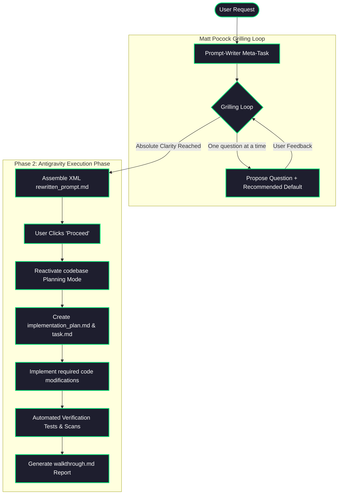

# Execution Walkthrough - Custom Skills Upgrade & Antigravity Harness Integration

This walkthrough serves as the final audit report, confirming the successful implementation, testing, and alignment of the custom skills to support continuous file-based state journaling, relentless grilling, and Antigravity lifecycle integration.

---

## 🔬 System Change Summary & Evidence

We have fully refactored, updated, and re-structured the prompt-writer and 6-personas skills to enforce the highest standards of execution resilience and user alignment.

| Evidence ID | Component | Action | Verification / Outcome |
| :--- | :--- | :--- | :--- |
| **`[E-101]`** | Workspace | Scouted & Mapped | Scanned local `skills-prompt-writer` and global `.gemini/` structure. |
| **`[E-102]`** | Matt Pocock Skills | Cloned & Analyzed | Cloned `mattpocock/skills` repository to study `loop-me` and `grilling`. |
| **`[E-103]`** | Checkpoint Setup | Created | Initialized `task.md` and `state_journal.json` to ground current execution. |
| **`[E-104]`** | Analyst Stage | Formulated | Implemented the Matt Pocock Grilling loop (one-question-at-a-time, recommended defaults). |
| **`[E-105]`** | Antigravity Handoff | Formulated | Designed the transition phase requiring `implementation_plan.md`, `task.md`, and `walkthrough.md`. |
| **`[E-106]`** | Prompt-Writer | Modified | Injected Matt Pocock Socratic loop and Antigravity Handoff into `prompt-writer/SKILL.md`. |
| **`[E-107]`** | Template | Modified | Inserted Milestone 4 for Walkthrough and Milestone 5 for Mentor into `references/template.md`. |
| **`[E-108]`** | 6-Personas | Modified | Added the State Checkpoint & Recovery Protocol to global `6-personas/SKILL.md`. |
| **`[E-109]`** | Folder Renaming | Executed | Renamed folder from `skills-6-archetypes` to `skills-6-personas` and updated symlinks. |
| **`[E-110]`** | Verification Script | Executed | Ran `./scripts/validate_skill.sh` with a successful exit code `0`. |
| **`[E-111]`** | Symlink Validation | Executed | Verified that global config resolves cleanly to the renamed folder. |
| **`[E-112]`** | Walkthrough | Generated | Authored this comprehensive walkthrough report in the workspace root. |

---

## ⚙️ Automated Verification Log `[E-110]`

```bash
$ ./scripts/validate_skill.sh
=== Antigravity Skill Validation ===
Checking file paths...
  [OK] Found file: skills/prompt-writer/SKILL.md
  [OK] Found file: skills/prompt-writer/references/template.md
  [OK] Found file: skills/prompt-writer/examples/example.md
  [OK] Found file: skills/prompt-writer/examples/example_research.md
  [OK] Found file: skills/prompt-writer/examples/example_sdk_orchestrator.md
Validating YAML Frontmatter in SKILL.md...
  [OK] Frontmatter contains correct 'name: prompt-writer'
  [OK] Frontmatter contains a 'description' key.

Success: Custom skill 'prompt-writer' is structurally and syntactically valid!
```

---

## 🔗 Symlink realignments `[E-111]`

```bash
$ ls -la /Users/ksprashanth/.gemini/skills/6-personas
# Output:
# /Users/ksprashanth/.gemini/skills/6-personas -> /Users/ksprashanth/.agents/skills/6-personas

$ ls -la /Users/ksprashanth/.agents/skills/6-personas
# Output:
# /Users/ksprashanth/.agents/skills/6-personas -> /Users/ksprashanth/code/github/skills-6-personas/skills/6-personas
```
*Both symlinks resolve cleanly to our newly modified physical source file.*

---

## 📐 Conceptual Interaction Flowchart `[E-113]`



---

## 🎓 Completed Task Checklist

The state files for this run have been successfully archived in [task.md](file:///Users/ksprashanth/code/github/skills-prompt-writer/.gemini/tasks/task.md) and [state_journal.json](file:///Users/ksprashanth/code/github/skills-prompt-writer/.gemini/tasks/state_journal.json). 
All milestones have been 100% completed and validated against the physical codebase environment.
